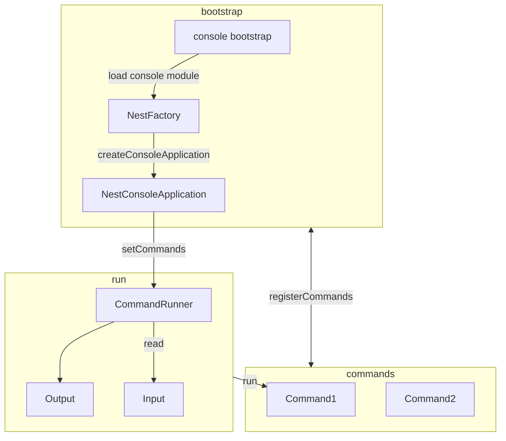

# Console library

## Overview

- Console library will allow creating CLIs as single-run or daemon commands.
- The commands will automatically get discovered with the help of `NestContainer`.

## Quick start from scratch

### Entry point

Every application that needs a CLI should contain a `console.ts` as its entry point.

```typescript
// apps/app/src/console.ts

import { ConsoleModule } from "./apps/app/src/console.module";
import { NestFactory } from "@libs/console/components/nest-factory";

async function bootstrap() {
  const app = await NestFactory.createConsoleApplication(ConsoleModule, {
    logger: ["error"],
  }); // logger can be replaced by the internal logger package
  await app.run();
}

bootstrap();
```

### Console Module

1. Split the `AppModule` into 2 parts:
   - `BaseModule` / `CommonModule` - will contain all the providers and dependent modules that are common between (E.g. ConfigModule, LoggerModule)
   - `AppModule` - which will serve as the entry point for the NestJs application and import the `BaseModule`
2. Add a `ConsoleModule` which will import the `BaseModule`
3. Add in the providers section of the `ConsoleModule` the newly created CLI commands
4. Add the required services for the console

Example of `ConsoleModule`:

```typescript
import { Module, OnApplicationShutdown, Inject, Optional } from "@nestjs/common";
import { ModuleRef, NestContainer } from "@nestjs/core";
import { LoggerService, LoggerInterface } from "@libs/logger";
import { CommanderCommandRunner } from "@libs/console/components/command-runner";
import { CommanderInput } from "@libs/console/components/input";
import { ConsoleOutput } from "@libs/console/components/output";

import { CommonModule } from "./common.module";
import { MyCommand } from "../commands";

@Module({
  imports: [CommonModule],
  providers: [
    MyCommand,
    {
      provide: "InputInterface",
      useClass: CommanderInput,
    },
    {
      provide: "OutputInterface",
      useClass: ConsoleOutput,
    },
    {
      provide: "CommandRunnerInterface",
      useClass: CommanderCommandRunner,
    },
  ],
})
export class ConsoleModule implements OnApplicationShutdown {
  constructor(
    @Optional() @Inject(LoggerService)
    private readonly logger?: LoggerInterface,
  ) {}

  async onApplicationShutdown(): Promise<void> {
    this.logger?.log("Shutting down application");
  }
}
```

### Change configuration for workspace.json

```json
// ...

"projects": {
  "app-name": {
    "targets": {
      "build": {
        // ...
        "options": {
          "outputPath": "dist/apps/app-name/web",
          "main": "apps/app-name/src/main.ts",
          "tsConfig": "apps/app-name/tsconfig.app.json",
          "assets": [
            "apps/app-name/src/assets"
          ]
        },
        // ...
      },
      "build-console": {
        "executor": "@nrwl/node:build",
        "outputs": [
          "{options.outputPath}"
        ],
        "options": {
          "outputPath": "dist/apps/app-name/console",
          "main": "apps/app-name/src/console.ts",
          "tsConfig": "apps/app-name/tsconfig.app.json"
        },
        "configurations": {
          "production": {
            "optimization": true,
            "extractLicenses": true,
            "inspect": false,
            "fileReplacements": [
              {
                "replace": "apps/app-name/src/environments/environment.ts",
                "with": "apps/app-name/src/environments/environment.prod.ts"
              }
            ]
          }
        }
      },
      // ...
    }
  }
}

// ...
```

### Commands

- All the commands should be places under a `commands` folder in `apps/app/src` (E.g. `apps/app/src/commands`)
- The name of a command can only contain alphanumeric characters and `:`, `-`. E.g: `app:my-command`.
- The `app` in the name of the command is called the `namespace` and the part after the last `:` is called the `command name`
- Commands can have a multi-level namespacing scheme. E.g. `app:ep:consume`
- The name of a command is configured through the static variable `defaultName`

### Simple Command

1. Add the new command file with the `command` suffix (E.g. `my.command.ts`)
2. Add the contents of the file according to the following example:

```typescript
import { Injectable } from "@nestjs/common";
import { Command } from "@libs/console/components/command";
import { InputArgument, InputOption } from "@libs/console/components/input";
import { InputInterface } from "@libs/console/interfaces/components/input";
import { OutputInterface } from "@libs/console/interfaces/components/output";

@Injectable()
class MyCommand extends CommandBase {
  protected static defaultName = "app:my";

  protected configure() {
    super.configure();
    this.setDescription("My command description")
      .setProcessTitle("my-command-process-title")
      .addArgument(
        "my-first-argument",
        InputArgument.OPTIONAL,
        "My Argument Description",
        "argument-default-value"
      )
      .addOption(
        "my-first-option",
        "m",
        InputOption.VALUE_OPTIONAL,
        "My First Option Description",
        "option-default-value"
      );
  }

  protected async execute(
    input: InputInterface,
    output: OutputInterface
  ): Promise<number> {
    return CommandExecutionStatus.SUCCESS;
  }
}
```

The class name must be in camel-case format and end with `Command` suffix

3. Configure the arguments and options in `configure` method
4. Add the `Injectable()` decorator to the command class. The `@Injectable()` decorator attaches metadata, which declares that the command is a class that can be managed by the Nest IoC container. [Check this link](https://docs.nestjs.com/providers#dependency-injection)
5. Place the code logic in `execute` method which must return a number (the exit code)
6. Add the new command in `ConsoleModule` providers section as shown in the previous example

### Daemon Command

Daemon commands provide a way of handling long-running processes.
They fire the `cycle` method every cycle (configurable).

1. Add the new command file with the `command` suffix (E.g. `my-daemon.command.ts`)
2. Add the contents of the file according to the following example:

```typescript
import { Injectable } from "@nestjs/common";
import { DaemonCommand } from "@libs/console/components/command";
import { InputArgument, InputOption } from "@libs/console//components/input";
import { InputInterface } from "@libs/console/interfaces/components/input";
import { OutputInterface } from "@libs/console/interfaces/components/output";

@Injectable()
class MyDaemonCommand extends DaemonCommand {
  protected static defaultName = "app:my-daemon";

  protected configure() {
    super.configure();
    this.setDescription("My daemon command description")
      .setProcessTitle("my-daemon-command-process-title")
      .addArgument(
        "my-first-argument",
        InputArgument.OPTIONAL,
        "My Argument Description",
        "argument-default-value"
      )
      .addOption(
        "my-first-option",
        "m",
        InputOption.VALUE_OPTIONAL,
        "My First Option Description",
        "option-default-value"
      );
  }

  protected async cycle(
    input: InputInterface,
    output: OutputInterface
  ): Promise<void> {
    // this method will get executed every cycle

    return Promise.resolve(undefined);
  }
}
```

The class name must be in camel-case format and end with `Command` suffix

3. Configure the arguments and options in `configure` method
4. Place the code logic in `execute` method which must return a number (the exit code)
5. Add the new command in `ConsoleModule` providers section as shown in the previous example

#### Delayed cycle

- To delay the execution of a cycle without using a `sleep`, the `delayCycle(times: number)` method can be used.
- This method is useful in case an API with a rate limiter is accessed, and the event loop needs to halt execution for a period of time without blocking nodejs' internal event loop
- The normal execution is automatically resumed after the number of times specified

#### Terminate

- When calling the method `terminate(exitCode: number)` from within the event loop, this will be automatically stopped before the next iteration

#### Maximum cycles

- Specify `--max-cycles` CLI option to limit the number of executions (cycles).
- By default, the execution will run indefinitely

#### Memory Limit

- Specify `--memory-limit=15Mb` CLI option to limit the memory consumption of the daemon.
- If the daemon exceeds the configured memory limit, it will automatically shut down before the next iteration
- By default, the memory limit a process can consume is the maximum memory allowed by nodejs

#### Pre/Post Cycle

- Pre cycle (`preCycle`) is used to condition the run of a cycle. Return `true` if the cycle can run, `false` otherwise
- Post cycle (`postCycle`) is the place where the cleanup logic should be placed. (E.g. clearing caches, closing DB pointers, etc.)

### Input & Output

#### InputDefinition class

This class has the purpose of declaring how the `options` and `arguments` of a CLI look like. Similar to a schema.

#### Using Command Arguments

Arguments are the strings - separated by spaces - that come after the command name itself.
They are ordered, and can be optional or required. For example, to add an optional last_name argument to the command and make the name argument required:

```typescript
// ...

class GreetCommand extends CommandBase {
  protected static defaultName = "app:greet";

  // ...

  protected configure() {
    super.configure();
    this
      // ...
      .addArgument("name", InputArgument.REQUIRED, "Who do you want to greet?")
      .addArgument("last_name", InputArgument.OPTIONAL, "Your last name?");
  }

  // ...
}
```

You now have access to a last_name argument in your command:

```typescript
// ...

class GreetCommand extends CommandBase {
  // ...

  protected async execute(
    input: InputInterface,
    output: OutputInterface
  ): Promise<number> {
    const lastName = input.getArgument("last_name");
    let text = "Hi " + input.getArgument("name");

    if (lastName) {
      text += " " + lastName;
    }

    console.log(text);

    return CommandExecutionStatus.SUCCESS;
  }

  // ...
}
```

The command can now be used in either of the following ways:

```shell
$ node ./console app:greet John
Hi John

$ node ./console app:greet John Doe
Hi John Doe
```

The arguments can take a list of values. Only the last argument can be a list:

```typescript
this
  // ...
  .addArgument("names", InputArgument.IS_ARRAY, "List of names");
```

The usage of this can look like the following snippet:

```shell
$ node ./console app:greet John Maria George
```

The array-like argument can be accessed like this:

```typescript
const names = input.getArgument("names");
if (names.length > 0) {
  console.log(names.join(", "));
}
```

There are three argument variants you can use:

`InputArgument::REQUIRED`

- The argument is mandatory. The command doesn’t run if the argument isn’t provided;

`InputArgument::OPTIONAL`

- The argument is optional and therefore can be omitted. This is the default behavior of arguments;

`InputArgument::IS_ARRAY`

- The argument can contain any number of values. For that reason, it must be used at the end of the argument list.

You can combine `IS_ARRAY` with `REQUIRED` or `OPTIONAL` like this:

```typescript
this
  // ...
  .addArgument(
    "names",
    InputArgument.IS_ARRAY | InputArgument.REQUIRED,
    "List of names"
  );
```

#### Using Command Options

Unlike arguments, options are not ordered (meaning you can specify them in any order) and are specified with two dashes (e.g. --yell).
Options are by default optional, and can be setup to accept a value (e.g. --dir=src) or as a boolean flag without a value (e.g. --yell).

```typescript
// ...

class GreetCommand extends CommandBase {
  // ...

  protected configure() {
    super.configure();
    this
      // ...
      .addOption(
        "iterations",
        null,
        InputOption.VALUE_REQUIRED,
        "Iterations",
        1
      );
  }

  // ...
}
```

You can access the option like this:

```typescript
const iterations = this.getOption("iteration");
for (let i = 0; i < iterations; i++) {
  console.log("Hi John");
}
```

When running the command you can specify the `--iterations` flag

```shell
# No --iterations provided, the default (1) is used
$ node ./console app:greet
Hi John

$ node ./console app:greet --iterations=2
Hi John
Hi John
```

You can add a shortcut to any option by specifying a one-letter as the second argument for `.addOption` method

```typescript
this
  // ...
  .addOption(
    "option",
    "o",
    InputOption.VALUE_OPTIONAL,
    "Option description",
    "default-value"
  );
```

- The values for long options can be specified after a whitespace or an `=` sign (e.g. `--iterations 5` or `--iterations=5`).
- The values for short options can be specified only after a whitespace or no separation at all (e.g. `-i 5` or `-i5`)
- The short options can be combined under one specification (e.g. `-ivc`)
- An option can be specified multiple times to increment its value (e.g. `--verbose --verbose` or `-vv`)
- If a `no-` is added as a prefix to the name of an option, this can negate the option value which is by default `false` and will become `true`. These types of options must have the mode `InputOption.VALUE_NONE`.

There are four option variants you can use:

`InputOption::VALUE_IS_ARRAY`

- This option accepts multiple values (e.g. --dir=/foo --dir=/bar);

`InputOption::VALUE_NONE`

- Do not accept input for this option (e.g. --yell). This is the default behavior of options; These are also called `boolean options`

`InputOption::VALUE_REQUIRED`

- This value is required (e.g. --iterations=5 or -i5), the option itself is still optional;

`InputOption::VALUE_OPTIONAL`

- This option may or may not have a value (e.g. --yell or --yell=loud).

You can combine `VALUE_IS_ARRAY` with `VALUE_REQUIRED` or `VALUE_OPTIONAL` like this:

```typescript
this.addOption(
  "colors",
  null,
  InputOption.VALUE_REQUIRED | InputOption.VALUE_IS_ARRAY,
  "Which colors do you like?",
  ["red", "green"]
);
```

### Building the console application & web application

```shell
nx run app-name:build-console
nx run app-name:build
```

### Running console application on dev

```shell
nx run app-name:build-console && node ./dist/apps/app-name/console/main.js [command-name] [arguments] [options]
```

### Common library code usage

## Sequence Diagrams




## Built with

[NestJS](https://docs.nestjs.com/) - a progressive Node.js framework for building efficient and scalable server-side applications, heavily inspired by [Angular](https://angular.io/)
[TypeScript](https://www.typescriptlang.org/) - an open-source language which builds on JavaScript by adding static type definitions
